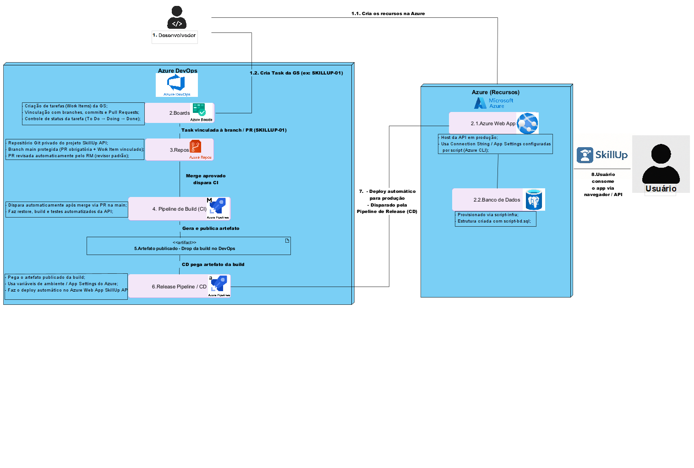

# 🚀 SkillUp API — Azure DevOps (CI/CD)

## 📘 Descrição do Projeto
A SkillUp API é uma aplicação Java Spring Boot voltada para gerenciamento de usuários, cursos, habilidades e recomendações personalizadas.

O projeto implementa Integração Contínua (CI) e Entrega Contínua (CD) utilizando o Azure DevOps, garantindo:

- Repositório Git com branch main protegida
- PR obrigatório com vínculo a Work Item
- Build automatizado após merge
- Artefato versionado e armazenado no Azure DevOps
- Deploy automático no Azure Web App
- Banco PostgreSQL configurado via script e variáveis de ambiente

Essa automação reduz erros, aumenta consistência e viabiliza entregas rápidas e seguras.

---

## ⚙️ Stack de Tecnologias
| Camada            | Tecnologias Utilizadas                            |
| ----------------- | ------------------------------------------------- |
| **Backend**       | Java 17 • Spring Boot 3 • Maven                   |
| **Cloud**         | Azure App Service • Azure Database for PostgreSQL |
| **CI/CD**         | Azure Pipelines (Build + Release)                 |
| **Versionamento** | Azure Repos (Git)                                 |
| **Gestão**        | Azure Boards                                      |
| **Outros**        | Azure CLI • Visual Paradigm • PostgreSQL          |

---

## 🧩 Arquitetura CI/CD



---

## 🧱 Detalhamento dos Componentes

| Componente                      | Tipo       | Descrição Funcional                                                     | Tecnologias                   |
| ------------------------------- | ---------- | ----------------------------------------------------------------------- | ----------------------------- |
| 💾 **Azure Repos**              | SCM        | Versionamento do código da API • Branch main protegida • PR obrigatório | Git (Azure Repos)             |
| 📋 **Azure Boards**             | Gestão     | Criação de Work Items • Vínculo com commits, PRs e builds               | Boards                        |
| 🧪 **Pipeline de Build (CI)**   | Automação  | Compila • Roda testes • Gera o artefato `.jar`                          | Azure Pipelines               |
| 📦 **Artefato (Drop)**          | Entrega    | Armazena o pacote final para deploy                                     | Azure Artifacts               |
| 🚀 **Pipeline de Release (CD)** | Automação  | Pega artefato • Configura variáveis • Faz deploy no Azure Web App       | Azure Pipelines               |
| ☁️ **Azure Web App**            | Hospedagem | Executa a API na nuvem • Configuração via App Settings                  | Azure App Service             |
| 🗄️ **PostgreSQL Cloud**        | Banco      | Persistência dos dados da API • Provisionado via script                 | Azure Database for PostgreSQL |

---

## 🧠 Estrutura da Aplicação

```text
src/
├── main/
│   ├── java/br/com/skillup/api/
│   │   ├── controller/        # Endpoints REST
│   │   ├── model/             # Entidades
│   │   ├── repository/        # JPA
│   │   ├── service/           # Regras de negócio
│   │   └── dto/               # DTOs
│   └── resources/
│       ├── application.properties
│       └── migrations/
└── test/
    └── java/                  # Testes unitários
````

---

## 🔁 Fluxo Completo CI/CD

### 1️⃣ Commit / Push
O desenvolvedor envia o código para o Azure Repos.


### 2️⃣ Pull Request
- PR obrigatório  
- PR vinculado ao Work Item  
- Revisão automática pelo RM (revisor padrão)


### 3️⃣ Merge na main
O merge aprovado aciona o CI automaticamente.


### 4️⃣ Pipeline de Build (CI)
- Maven clean install  
- Testes automatizados  
- Geração do artefato `.jar`  
- Publicação no `drop`  


### 5️⃣ Pipeline de Release (CD)
- Pega o artefato publicado  
- Configura variáveis de ambiente  
- Faz deploy no Azure Web App  


### 6️⃣ Web App Online
API atualizada automaticamente e disponível para o usuário final.

---

## 🔐 Variáveis de Ambiente

Todas configuradas no **Azure DevOps** e consumidas pela API:
```text
-SPRING_DATASOURCE_URL "$(SPRING_DATASOURCE_URL)"
-SPRING_DATASOURCE_USERNAME "$(SPRING_DATASOURCE_USERNAME)"
-SPRING_DATASOURCE_PASSWORD "$(SPRING_DATASOURCE_PASSWORD)"
```
application.properties:
```text
spring.datasource.url=${SPRING_DATASOURCE_URL}
spring.datasource.username=${SPRING_DATASOURCE_USERNAME}
spring.datasource.password=${SPRING_DATASOURCE_PASSWORD}
server.port=8080
```

---

## 📦 Banco de Dados — Estrutura

| Entidade               | Descrição                    | Principais Atributos                                                       |
| ---------------------- | ---------------------------- | -------------------------------------------------------------------------- |
| **USUARIO**            | Pessoas cadastradas          | ID_USUARIO, NOME, EMAIL, PROFISSAO_ATUAL, META_PROFISSIONAL                |
| **CURSO**              | Cursos disponíveis           | ID_CURSO, NOME, AREA, NIVEL, CARGA_HORARIA                                 |
| **HABILIDADE**         | Habilidades existentes       | ID_HABILIDADE, NOME, DESCRICAO                                             |
| **USUARIO_HABILIDADE** | Relação usuário ↔ habilidade | ID_USUARIO, ID_HABILIDADE, NIVEL_DOMINIO                                   |
| **RECOMENDACAO**       | Sugestões da IA              | ID_RECOMENDACAO, ID_USUARIO, ID_CURSO, SCORE_COMPATIBILIDADE, DATA_GERACAO |

---

## 🔥 CRUD EXPOSO EM JSON
Endpoints da SkillUp API no formato **JSON** (Create, Read, Update, Delete).

---

# 1️⃣ USUÁRIO — `/api/usuarios`


### 🟢 CREATE — `POST /api/usuarios`

```json
{
  "nome": "João da Silva",
  "email": "joao@gmail.com",
  "senha": "123456",
  "profissaoAtual": "Analista",
  "metaProfissional": "Desenvolvedor Backend"
}

Resposta (201 – Created)
{
  "id": 1,
  "nome": "João da Silva",
  "email": "joao@gmail.com",
  "profissaoAtual": "Analista",
  "metaProfissional": "Desenvolvedor Backend"
}
```

###🔵 READ — GET /api/usuarios/1
```json
{
  "id": 1,
  "nome": "João da Silva",
  "email": "joao@gmail.com",
  "profissaoAtual": "Analista",
  "metaProfissional": "Desenvolvedor Backend"
}
```

###🟡 UPDATE — PUT /api/usuarios/1
```json
{
  "nome": "João da Silva",
  "email": "joao@gmail.com",
  "senha": "123456",
  "profissaoAtual": "Desenvolvedor Backend",
  "metaProfissional": "Arquiteto de Software"
}

Resposta (200 – OK)
{
  "id": 1,
  "nome": "João da Silva",
  "email": "joao@gmail.com",
  "profissaoAtual": "Desenvolvedor Backend",
  "metaProfissional": "Arquiteto de Software"
}
```

###🔴 DELETE — DELETE /api/usuarios/1
```json
{
  "mensagem": "Usuário removido com sucesso"
}
```

# 2️⃣ CURSO — /api/cursos

###🟢 CREATE — POST /api/cursos
```json
{
  "nome": "Java Fundamentos",
  "area": "Programação",
  "nivel": "Iniciante",
  "cargaHoraria": 40
}

Resposta (201 – Created)
{
  "id": 1,
  "nome": "Java Fundamentos",
  "area": "Programação",
  "nivel": "Iniciante",
  "cargaHoraria": 40
}
```

###🔵 READ — GET /api/cursos/1
```json
{
  "nome": "Java Fundamentos",
  "area": "Programação",
  "nivel": "Intermediário",
  "cargaHoraria": 60
}

Resposta (201 – Created)
{
  "id": 1,
  "nome": "Java Fundamentos",
  "area": "Programação",
  "nivel": "Intermediário",
  "cargaHoraria": 60
}
```

###🟡 UPDATE — PUT /api/cursos/1
```json
{
  "nome": "Java Fundamentos",
  "area": "Programação",
  "nivel": "Intermediário",
  "cargaHoraria": 60
}

Resposta (200 – OK)
{
  "id": 1,
  "nome": "Java Fundamentos",
  "area": "Programação",
  "nivel": "Intermediário",
  "cargaHoraria": 60
}
```

###🔴 DELETE — DELETE /api/cursos/1
```json
{
  "mensagem": "Curso removido com sucesso"
}
```

# 3️⃣ RECOMENDAÇÕES — /api/recomendacoes

###🟢 GERAR RECOMENDAÇÕES — POST /api/recomendacoes/gerar
```json
{
  "usuarioId": 1
}

Resposta (200 – OK)
[
  {
    "id": 10,
    "usuarioId": 1,
    "cursoId": 5,
    "nomeCurso": "Java Fundamentos",
    "scoreCompatibilidade": 0.87,
    "dataGeracao": "2025-05-22T14:30:00"
  }
]
```

###🔵 LISTAR RECOMENDAÇÕES DO USUÁRIO — GET /api/recomendacoes/usuario/1
```json
[
  {
    "id": 10,
    "usuarioId": 1,
    "cursoId": 5,
    "nomeCurso": "Java Fundamentos",
    "scoreCompatibilidade": 0.87,
    "dataGeracao": "2025-05-22T14:30:00"
  }
]
```

---

## 🌐 Links Importantes

| Recurso                       | Link           |
| ----------------------------- | -------------- |
| 🔗 Azure DevOps (projeto)     | [Acessar Pipeline no Azure DevOps](https://dev.azure.com/RM558438/GS%202%20-%20DEVOPS%20TOOLS%20and%20CLOUD%20COMPUTING) |
| 🔗 Azure Web App (API Online) | [Acessar API hospedada](https://skillup-api-web.azurewebsites.net) |
| 🎥 Vídeo da apresentação      | [Assistir vídeo da entrega](https://youtu.be/jhwL2frxJrM) |
| 📦 Repositório GitHub         | [Acessar Repositório GitHub](https://github.com/enzodam/skillup-devops-gs2) |

## 👨‍💻 Desenvolvedores

| Nome                          | RM     | GitHub                                             |
| ----------------------------- | ------ | -------------------------------------------------- |
| Enzo Dias Alfaia Mendes       | 558438 | [@enzodam](https://github.com/enzodam)             |
| Matheus Henrique Germano Reis | 555861 | [@MatheusReis48](https://github.com/MatheusReis48) |
| Luan Dantas dos Santos        | 559004 | [@lds2125](httpsgithub.com/lds2125)                |

---

## ✅ Conclusão

A SkillUp API implementa um pipeline completo, profissional e automatizado, com:

✔ CI/CD  
✔ Deploy automático  
✔ Infra provisionada corretamente  
✔ Variáveis seguras  
✔ CRUD documentado  
✔ Boards + Repos + Pipelines integrados

